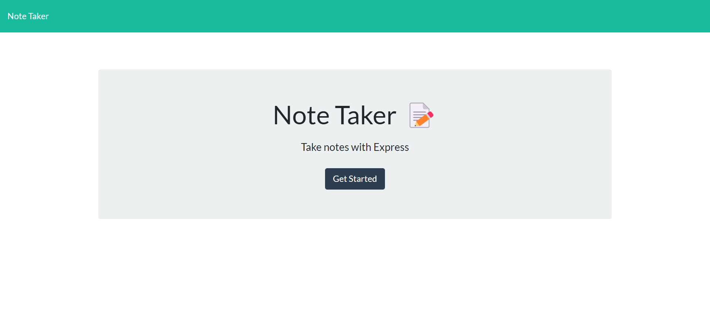
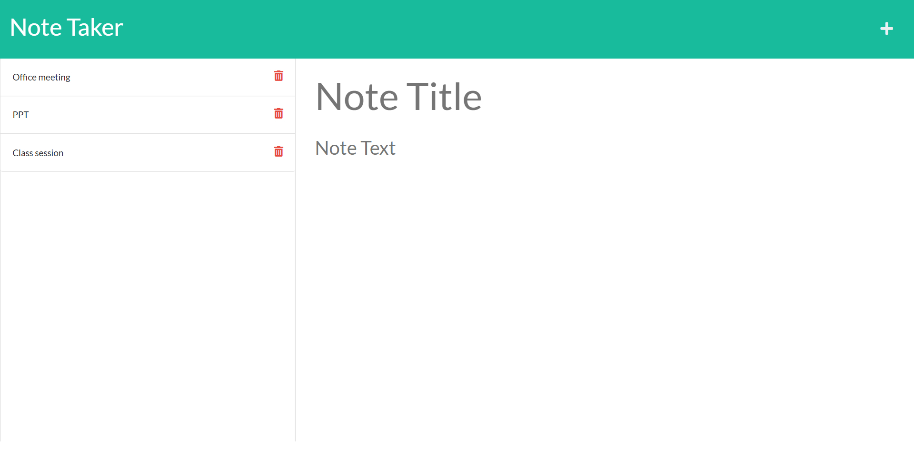
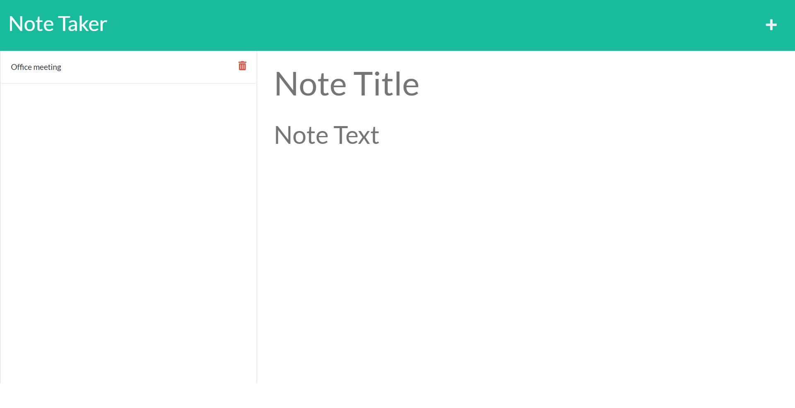

# Note-Taker-Repo# Note-Taker


## Description :

This is a simple Note Taker application that allows users to add, view saved notes and also delete the notes if the user don't need that note anymore. This application uses an express backend and save and retrieve note data from a JSON file.


## Table of Contents

* [Technology](#technology)
* [Usage](#usage)
* [Features](#features)
* [License](#license)
* [Contribution](#contribution)
* [Questions](#questions)

## User Story

```
AS A user, I want to be able to write and save notes.

I WANT to be able to delete notes I've written before.

SO THAT I can organize my thoughts and keep track of tasks I need to complete
```

## Business Context

* For users that need to keep track of a lot of information, it's easy to forget or be unable to recall something important. 

* Being able to take persistent notes allows users to have written information available when needed.


## Application Preview : 

|Main Page|Saved Notes|Delete Note
|--|--|--
|||

## Technology :

**1. [Express.js](https://expressjs.com/)**


**2. [Node.js](https://nodejs.org/en/)** 


**3. [uuid](https://www.npmjs.com/package/uuid)**

```
npm i
```

* The application will be invoked with the following command: This will start localhost server on PORT 3001.

```
node server.js
```

* Open browser and type `http://localhost:3001/` to run this application on your local machine.

## Features :

1. Used 'Express.js' to build server

2. Used 'fs(File System)' module to read and write from 'db.json' file.

3. Used [uuid](https://www.npmjs.com/package/uuid) npm package to give unique id to each note.

4. Application is deployed on [heroku](https://www.heroku.com/) : Heroku is a container-based cloud Platform as a Service (PaaS). Developers use Heroku to deploy, manage, and scale modern apps.

## License

This project is licensed under MIT license.

## Contribution

Pull requests are always welcome!

## Questions

If you have any questions about the repo, 
[open an issue](https://github.com/programer122223/) 
or contact me directly at [Email](mailto:pratibha.indel@gmail.com).